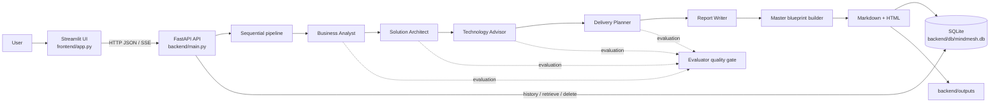
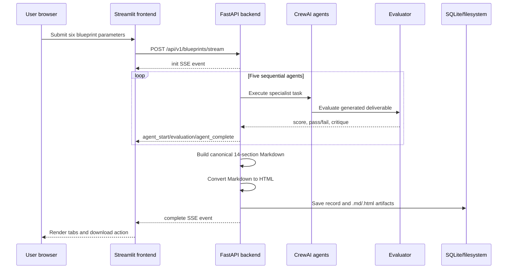

# MindMesh

## AI Solution Architecture Blueprint Engine

MindMesh is a full-stack, multi-agent architecture-planning application. It accepts a plain-language product idea and delivery constraints, then uses a sequential CrewAI workflow to produce an enterprise-style solution blueprint.

The generated blueprint combines:

- Business analysis and MVP scope
- Functional and non-functional requirements
- High-level system architecture and component interactions
- Technology-stack recommendations and trade-offs
- Implementation workstreams, team roles, milestones, and effort
- Testing, deployment, risk, compliance, and future-evolution guidance

The application is intended for product owners, founders, business analysts, solution architects, engineering managers, technical consultants, and delivery teams who need a structured starting point for architecture and delivery planning before implementation begins.

> **Important:** MindMesh generates architecture recommendations. It does not replace security review, compliance/legal advice, capacity testing, cost validation, or an implementation team's technical judgment.

---

## Table of contents

1. [What the project does](#what-the-project-does)
2. [Architecture at a glance](#architecture-at-a-glance)
3. [Technology stack](#technology-stack)
4. [Repository structure](#repository-structure)
5. [Prerequisites](#prerequisites)
6. [Installation and configuration](#installation-and-configuration)
7. [Running the application](#running-the-application)
8. [Using the application](#using-the-application)
9. [Multi-agent execution pipeline](#multi-agent-execution-pipeline)
10. [API contract](#api-contract)
11. [Persistence and generated files](#persistence-and-generated-files)
12. [Configuration reference](#configuration-reference)
13. [Development notes](#development-notes)
14. [Troubleshooting](#troubleshooting)
15. [Limitations and production considerations](#limitations-and-production-considerations)

---

## What the project does

At a high level, a user:

1. Describes a proposed product, its users, features, and business workflow.
2. Selects a preferred technology ecosystem and cloud platform.
3. Describes the expected traffic and scale in free text.
4. Sets a delivery timeline and data-hosting jurisdiction.
5. Starts blueprint generation.
6. Watches the five specialist agents execute in real time.
7. Reviews the final blueprint in HTML and section-specific tabs.
8. Downloads the HTML report or reopens/deletes previous runs from the history sidebar.

The frontend defaults to `http://localhost:8000` for the backend. The backend exposes both a synchronous JSON endpoint and an SSE streaming endpoint. The Streamlit UI uses the streaming endpoint so users can see agent progress, retries, and quality-gate events as they happen.

## Architecture at a glance



### Runtime request flow



### Service boundaries

| Service | Location | Default address | Responsibility |
| --- | --- | --- | --- |
| Frontend | `frontend/` | `http://localhost:8501` | Streamlit form, progress UI, history sidebar, report viewer |
| Backend | `backend/` | `http://localhost:8000` | FastAPI routes, agent orchestration, evaluation, persistence |
| LLM providers | Configured externally | External API | Generate specialist and evaluation responses |
| Search provider | Serper.dev | External API | Web search tool available to specialist agents |
| Local storage | `backend/db/`, `backend/outputs/` | Local filesystem | Blueprint history and exported artifacts |

## Technology stack

### Frontend

- **Python 3.11+**
- **Streamlit** for the interactive web interface
- Python standard-library `urllib` client for backend HTTP calls
- Server-Sent Events (SSE) parsing for live generation progress
- Custom CSS in `frontend/styles.py`

### Backend

- **FastAPI** for the HTTP API and OpenAPI documentation
- **Pydantic v2** for request validation and settings
- **Uvicorn/FastAPI CLI** for local development serving
- **CrewAI** for agent/task/crew orchestration
- **Google Gemini through CrewAI/LiteLLM integration** for agent generation
- **CrewAI Tools / SerperDevTool** for web search
- **SQLite** through Python's `sqlite3` module for history
- **Markdown** conversion to downloadable HTML

### Workspace and dependency management

- **uv** manages the Python environment and lockfile.
- The repository root is a uv workspace containing the frontend application and the `backend` workspace member.
- `uv.lock` records resolved dependency versions.
- The backend has its own `backend/pyproject.toml`; the root `pyproject.toml` declares the frontend dependencies.

## Repository structure

```text
mindmesh/
├── frontend/
│   ├── app.py                  # Streamlit entry point and UI state router
│   ├── api_client.py           # Health, generation, history, retrieve, delete calls
│   ├── constants.py            # Presets, select-box options, agent metadata
│   ├── styles.py               # Frontend design system/CSS
│   ├── components/
│   │   ├── header.py            # Hero header and backend status
│   │   └── sidebar.py           # Saved blueprint history
│   └── views/
│       ├── form_view.py         # Six-parameter input form and validation
│       ├── execution_view.py   # Live SSE progress display
│       └── dashboard_view.py   # HTML report and section tabs
├── backend/
│   ├── main.py                 # FastAPI application and route registration
│   ├── pyproject.toml          # Backend dependency manifest
│   ├── .env.example            # Required environment-variable template
│   ├── src/
│   │   ├── config.py           # Pydantic settings loaded from .env
│   │   ├── crew.py             # Standard five-agent CrewAI crew
│   │   ├── pipeline.py         # Streaming execution and evaluation gates
│   │   ├── evaluation.py       # Evaluator invocation and score parsing
│   │   ├── blueprint_builder.py # Canonical 14-section report composition
│   │   ├── llm.py              # Per-agent model/key construction
│   │   ├── tools.py            # Shared Serper search tool
│   │   ├── db.py               # SQLite schema and CRUD/history sync
│   │   ├── routes/
│   │   │   ├── blueprint.py    # Blueprint API contract
│   │   │   └── health.py       # Health endpoints
│   │   ├── agents/             # Agent definitions, prompts, and task factories
│   │   └── utils/              # HTML conversion, file output, section parsing
│   ├── db/mindmesh.db          # Local SQLite database (created/updated at runtime)
│   └── outputs/                # Generated Markdown and HTML files
├── pyproject.toml              # Root project and uv workspace configuration
├── uv.lock                     # Locked dependency graph
└── README.md
```

## Prerequisites

Install the following before starting:

- Python **3.11 or newer**
- [uv](https://docs.astral.sh/uv/) installed and available on `PATH`
- Internet access for package installation and LLM/search API calls
- A Gemini API key for each configured agent role
- A Serper.dev API key

On Windows PowerShell, verify the tools:

```powershell
python --version
uv --version
```

## Installation and configuration

### 1. Install dependencies

From the repository root:

```powershell
cd C:\Users\rahul\OneDrive\Desktop\CTS\mindmesh
uv sync
```

`uv sync` creates or updates the uv-managed environment and installs the root project plus the backend workspace dependencies from the lockfile. Use the project environment for both services so the versions in `uv.lock` are used consistently. Run it again after changing either `pyproject.toml` file.

### 2. Create the backend environment file

Copy the template:

```powershell
Copy-Item backend\.env.example backend\.env
```

Open `backend\.env` and replace every placeholder with a real value. The backend requires the following credentials:

- `GEMINI_API_KEY_BA`
- `GEMINI_API_KEY_SA`
- `GEMINI_API_KEY_TA`
- `GEMINI_API_KEY_DP`
- `GEMINI_API_KEY_RW`
- `GEMINI_API_KEY_EV`
- `SERPER_API_KEY`
- `OPENROUTER_API_KEY` (optional — enables the automatic OpenRouter fallback when a primary LLM call fails)

Do not commit `backend\.env` or expose API keys in the frontend. The frontend only calls the local backend; provider credentials are loaded by the backend.

### 3. Configure models and runtime behavior

The `.env.example` file includes model names and defaults for retries, evaluation, timeout, and logging. Confirm that each model name is supported by the installed CrewAI/LiteLLM integration. See [Configuration reference](#configuration-reference).

The backend resolves `.env` relative to `backend/src/config.py`, so the file must be located at `backend\.env`; the current working directory does not affect configuration loading.

## Running the application

Run the backend and frontend in **separate terminals**.

### Terminal 1: start the backend

```powershell
cd C:\Users\rahul\OneDrive\Desktop\CTS\mindmesh\backend
uv run fastapi dev main.py
```

The API should be available at:

- Application: `http://localhost:8000`
- OpenAPI Swagger UI: `http://localhost:8000/docs`
- ReDoc: `http://localhost:8000/redoc`
- Health check: `http://localhost:8000/health`
- Versioned health check: `http://localhost:8000/api/v1/health`

### Terminal 2: start the frontend

```powershell
cd C:\Users\rahul\OneDrive\Desktop\CTS\mindmesh
uv run streamlit run frontend\app.py
```

Open the URL printed by Streamlit, normally `http://localhost:8501`.

The frontend's API base URL is initialized in `frontend/app.py` as `http://localhost:8000`. If the backend runs elsewhere, update `st.session_state.api_url` initialization in `frontend/app.py` before starting the frontend.

### Stop the services

Press `Ctrl+C` in each terminal. The backend and frontend are independent processes, so stopping one does not stop the other.

### Theme

Use the Streamlit main menu to switch between **Light**, **Dark**, and **System** themes. MindMesh applies custom theme-aware CSS to the Streamlit page. The generated blueprint is rendered in its own HTML iframe and may retain its report-specific styling.

## Using the application

### Input fields

The form in `frontend/views/form_view.py` sends one JSON object with six required fields:

| Field | Type | Meaning | UI constraints/examples |
| --- | --- | --- | --- |
| `business_idea` | string | Product concept, users, features, and workflow | The UI asks for at least 15 non-whitespace characters |
| `technology_preference` | string | Preferred technology ecosystem | Open-Source Stack, Enterprise Stack, Microservices Mesh, Serverless Ecosystem, or No Preference |
| `cloud_preference` | string | Primary hosting preference | AWS, GCP, Azure, Multi-Cloud, On-Premises, or No Preference |
| `expected_daily_traffic` | string | Expected scale profile | Free text, for example `50,000 daily users, peak 2,500 requests/sec` |
| `delivery_timeline_months` | integer | Target MVP delivery duration | UI range is 1–36 months |
| `data_hosting_country` | string | Data residency/jurisdiction target | Free text, for example `India`, `United States`, or `EU/Germany` |

Preset templates are available for HealthTech, FinTech, and Smart Logistics/Fleet use cases. They are convenience values only; all fields can be changed before submission. Technology and cloud remain select boxes; traffic/scale and data-hosting jurisdiction are text inputs.

### Output

Each successful run produces:

- A short `run_id` (the first 12 characters of a UUID)
- A canonical Markdown blueprint
- A styled HTML blueprint
- A SQLite history record
- `backend/outputs/{run_id}.md`
- `backend/outputs/{run_id}.html`

The canonical report contains these 14 sections:

1. Delivery Overview
2. Business / MVP Scope and Priorities
3. Recommended Technology Stack
4. Implementation Workstreams
5. Recommended Team and Roles
6. Delivery Timeline and Milestones
7. Effort & Complexity Assessment
8. Dependencies and Prerequisites
9. High-Level Solution Architecture
10. Testing & Quality Strategy
11. Deployment & Release Strategy
12. Delivery Risks & Mitigations
13. Future Evolution
14. Assumptions & Open Questions

The dashboard exposes the full HTML report and tabs for Business Analysis, System Architecture, Technology Stack & Trade-offs, and Delivery Roadmap.

## Multi-agent execution pipeline

The standard crew in `backend/src/crew.py` is sequential. Each downstream task receives the relevant upstream task context:

| Order | Agent | Primary responsibility |
| --- | --- | --- |
| 1 | Business Analyst | Stakeholders, goals, functional requirements, non-functional requirements, MVP scope |
| 2 | Solution Architect | Components, data flows, security perimeter, scalability, architecture topology |
| 3 | Technology Advisor | Technology choices, alternatives, trade-offs, operational implications |
| 4 | Delivery Planner | Workstreams, milestones, team shape, effort, risks, testing and release plan |
| 5 | Report Writer | Cross-discipline synthesis and authoritative executive blueprint |

When enabled, the evaluator runs after each specialist deliverable in the streaming pipeline. If the score is below `EVALUATION_THRESHOLD`, the pipeline retries the specialist task up to `MAX_AGENT_RETRIES` times. Provider and evaluator calls also use bounded retries and `AGENT_TIMEOUT_SECONDS`; these failures are reported through `agent_retry` events.

The final report is assembled by `build_master_blueprint`; it does not simply concatenate raw agent responses. Topic-specific extraction routes content into the 14 stable headings and converts the result to HTML.

## API contract

The backend registers the health router at both the root and `/api/v1` prefixes, and registers blueprint routes under `/api/v1/blueprints`.

### Base URLs

```text
http://localhost:8000
http://localhost:8000/api/v1
```

FastAPI also publishes the interactive contract at `/docs` and the machine-readable schema at `/openapi.json`.

### Request schema: `BlueprintRequest`

```json
{
  "business_idea": "An online platform for booking home healthcare services",
  "technology_preference": "Open-Source Stack",
  "cloud_preference": "AWS",
  "expected_daily_traffic": "10,000 DAU (Standard MVP Scale)",
  "delivery_timeline_months": 3,
  "data_hosting_country": "India"
}
```

Pydantic validates the JSON shape, primitive types, and field bounds:

| Field | Type | Minimum | Maximum |
| --- | --- | --- | --- |
| `business_idea` | string | 15 chars | 5000 chars |
| `technology_preference` | string | 1 char | 100 chars |
| `cloud_preference` | string | 1 char | 100 chars |
| `expected_daily_traffic` | string | 1 char | 100 chars |
| `delivery_timeline_months` | integer | 1 | 36 |
| `data_hosting_country` | string | 1 char | 100 chars |

Invalid input returns HTTP `422` automatically. Business-level option
validation is primarily performed in the Streamlit form.

### `GET /health` and `GET /api/v1/health`

Returns a lightweight liveness response:

```json
{
  "status": "ok"
}
```

The frontend tries `/health`, `/api/v1/health`, and `/api/v1/blueprints/list` when checking connectivity.

### `POST /api/v1/blueprints` or `/api/v1/blueprints/generate`

Runs the standard asynchronous CrewAI kickoff, waits for completion, persists the result, and returns JSON.

**Success:** HTTP `201 Created`

```json
{
  "run_id": "efc2fc1f-032",
  "status": "completed",
  "file_saved": "outputs/efc2fc1f-032.html",
  "markdown": "# Enterprise Solution Blueprint\n...",
  "result": "<!DOCTYPE html>..."
}
```

- `run_id`: identifier used by history, retrieval, and deletion endpoints.
- `file_saved`: relative HTML artifact path.
- `markdown`: canonical report source.
- `result`: generated HTML presentation.

**Failure:** HTTP `500`

```json
{
  "detail": "Blueprint generation failed: <provider or pipeline error>"
}
```

### `POST /api/v1/blueprints/stream`

Runs the same five-agent process but returns `text/event-stream`. Each message is an SSE record with a JSON object after `data:`.

Example:

```text
data: {"event":"init","run_id":"efc2fc1f-032","message":"Initialized multi-agent pipeline with quality evaluation gates.","progress":3}

data: {"event":"agent_start","agent":"Business Analyst","step":1,"total":5,"role":"Requirements & MVP Scope Analyst","message":"...","progress":5}

data: {"event":"evaluation","agent":"Business Analyst","step":1,"score":0.86,"passed":true,"summary":"...","critique":[],"remediation":"None","message":"Evaluator Score: 0.86 — Accepted","progress":11}

data: {"event":"agent_complete","agent":"Business Analyst","step":1,"total":5,"output":"...","message":"...","progress":22}

data: {"event":"agent_retry","agent":"Business Analyst","step":1,"retry_count":1,"message":"Business Analyst LLM call failed; retrying ...","progress":6}

data: {"event":"complete","run_id":"efc2fc1f-032","status":"completed","progress":100,"markdown":"...","html":"...","sections":{}}
```

#### SSE event types

| Event | Purpose | Important fields |
| --- | --- | --- |
| `init` | Pipeline created | `run_id`, `message`, `progress` |
| `agent_start` | Agent began work | `agent`, `step`, `total`, `role`, `message`, `progress` |
| `evaluation_start` | Quality gate began | `agent`, `step`, `message`, `progress` |
| `evaluation` | Quality score returned | `agent`, `step`, `score`, `passed`, `summary`, `critique`, `remediation`, `progress` |
| `agent_retry` | LLM or evaluator call is being retried, or a below-threshold result is being regenerated | `agent`, `step`, `retry_count`, `message`, `progress` |
| `agent_complete` | Agent deliverable completed | `agent`, `step`, `output`, `message`, `progress` |
| `complete` | Final report built and saved | `run_id`, `status`, `markdown`, `html`, `sections`, `progress` |
| `error` | Pipeline failed | `run_id`, `error`, `message` |

On `complete`, the backend saves the record to SQLite and writes both Markdown and HTML files. On an execution exception, the stream emits an `error` event rather than returning a normal JSON response.

### `GET /api/v1/blueprints`, `/list`, or `/history`

Returns up to 100 history entries:

```json
{
  "total": 1,
  "run_ids": ["efc2fc1f-032"],
  "history": [
    {
      "id": 1,
      "run_id": "efc2fc1f-032",
      "created_at": "2026-09-20 14:45:00",
      "business_idea": "An online platform...",
      "technology_preference": "Open-Source Stack",
      "cloud_preference": "AWS",
      "expected_daily_traffic": "10,000 DAU (Standard MVP Scale)",
      "delivery_timeline_months": 3,
      "data_hosting_country": "India",
      "status": "completed"
    }
  ]
}
```

If the database has no records but output files exist, the endpoint can discover HTML files from `backend/outputs` as a filesystem fallback.

### `GET /api/v1/blueprints/{run_id}`

Returns a saved blueprint from SQLite first, then falls back to `{run_id}.md` and `{run_id}.html` in `backend/outputs`.

```json
{
  "run_id": "efc2fc1f-032",
  "status": "completed",
  "result": "<!DOCTYPE html>...",
  "markdown": "# Enterprise Solution Blueprint\n...",
  "html": "<!DOCTYPE html>...",
  "sections": {
    "business_analyst": "...",
    "solution_architect": "...",
    "technology_advisor": "...",
    "delivery_planner": "..."
  },
  "created_at": "2026-09-20 14:45:00",
  "business_idea": "An online platform...",
  "technology_preference": "Open-Source Stack",
  "cloud_preference": "AWS"
}
```

The `sections` object maps each agent role to its extracted content from
the canonical 14-section report: Business Analyst → §2, Solution Architect
→ §9, Technology Advisor → §3, Delivery Planner → §4+§5+§6 combined.

If the run does not exist, the endpoint returns HTTP `404`:

```json
{
  "detail": "Blueprint output for run_id 'unknown-id' not found."
}
```

`run_id` must be exactly 12 lowercase hexadecimal characters
(`[0-9a-f]{12}`). Invalid values (including path-traversal attempts such as
`../x` or `..\x`) return HTTP `400`.

### `DELETE /api/v1/blueprints/{run_id}`

Deletes the SQLite record and any matching `.md`/`.html` files.

**Success:** HTTP `200`

```json
{
  "run_id": "efc2fc1f-032",
  "status": "deleted",
  "message": "Successfully deleted blueprint efc2fc1f-032 from SQLite and storage."
}
```

The reserved `final_output` artifact cannot be deleted and returns HTTP `400`. A missing run returns HTTP `404`.

### CORS

The backend restricts CORS to `http://localhost:8501` (the Streamlit
frontend) with explicit methods and headers. Credentials are disabled to
prevent origin-reflection attacks. To allow a different frontend origin, edit
`backend/main.py` before deploying.

## Persistence and generated files

The SQLite database is `backend/db/mindmesh.db`. The `blueprints` table stores:

- Numeric database ID
- Unique `run_id`
- Creation timestamp
- All six request inputs
- Markdown and HTML content
- Status

The filesystem copy in `backend/outputs` is intentionally maintained as a fallback/export path:

```text
backend/outputs/
├── <run_id>.md
├── <run_id>.html
├── final_output.md
└── final_output.html
```

The database module initializes the schema on import and can backfill Markdown files that exist without database rows. Treat the local database and output directory as application data; back them up or replace them with managed storage for a multi-instance deployment.

## Configuration reference

All backend settings are loaded from `backend/.env` through `pydantic-settings`.

| Variable | Required | Default/example | Purpose |
| --- | --- | --- | --- |
| `APP_NAME` | No | `MindMesh API` | FastAPI title |
| `API_SECRET_KEY` | No | empty | Shared-secret for `/blueprints` routes; skipped when empty |
| `GEMINI_API_KEY_BA` | Yes | placeholder | Business Analyst credential |
| `GEMINI_API_KEY_SA` | Yes | placeholder | Solution Architect credential |
| `GEMINI_API_KEY_TA` | Yes | placeholder | Technology Advisor credential |
| `GEMINI_API_KEY_DP` | Yes | placeholder | Delivery Planner credential |
| `GEMINI_API_KEY_RW` | Yes | placeholder | Report Writer credential |
| `GEMINI_API_KEY_EV` | Yes | placeholder | Evaluator credential |
| `BA_MODEL` | Yes | Gemini model name | Business Analyst model |
| `SA_MODEL` | Yes | Gemini model name | Solution Architect model |
| `TA_MODEL` | Yes | Gemini model name | Technology Advisor model |
| `DP_MODEL` | Yes | Gemini model name | Delivery Planner model |
| `RW_MODEL` | Yes | Gemini model name | Report Writer model |
| `EVALUATION_MODEL` | Yes | Gemini model name | Evaluator model |
| `SERPER_API_KEY` | Yes | placeholder | Serper search tool credential |
| `OPENROUTER_API_KEY` | No | empty | OpenRouter credential; when set, failed primary LLM calls fall back to OpenRouter |
| `OPENROUTER_FALLBACK_MODEL` | No | `openrouter/google/gemini-2.0-flash-001` | LiteLLM-style OpenRouter model id used by the fallback |
| `ENABLE_OPENROUTER_FALLBACK` | No | `true` | Master switch for the OpenRouter fallback |
| `OPENROUTER_FALLBACK_ON_ALL_ERRORS` | No | `true` | Fall back on any primary error; when `false`, only on transient provider errors |
| `MAX_AGENT_RETRIES` | No | `2` | Maximum remediation retries per evaluated step |
| `ENABLE_EVALUATION` | No | `true` | Enables evaluator quality gates |
| `EVALUATION_THRESHOLD` | No | `0.70` | Minimum score required to pass |
| `AGENT_TIMEOUT_SECONDS` | No | `120` | Configured agent runtime budget |
| `LOG_LEVEL` | No | `INFO` | Application logging setting |

## Development notes

### Adding or changing an agent

An agent is split into three concerns under `backend/src/agents/<agent_name>/`:

- `agent.py`: CrewAI `Agent` construction and model/tool wiring
- `prompt.py`: role-specific behavior and output guidance
- `task.py`: task inputs, expected output, and context dependencies

After adding an agent, update the crew ordering in `src/crew.py`, the streaming pipeline in `src/pipeline.py`, the frontend metadata in `frontend/constants.py`, and the event rendering logic in `frontend/views/execution_view.py`.

### Changing the report contract

The report structure is centralized in `src/blueprint_builder.py`. If
headings change, update the corresponding extraction patterns in:

- `backend/src/utils/section_parser.py` — maps agent tabs to canonical
  `## N.` headings (BA→§2, SA→§9, TA→§3, DP→§4+§5+§6 combined)
- `frontend/views/dashboard_view.py` — consumes the API `sections` field

This keeps API `sections`, dashboard tabs, and generated Markdown aligned.

### API exploration

FastAPI generates the current runtime contract:

```text
http://localhost:8000/docs
http://localhost:8000/openapi.json
```

Use these endpoints as the final authority when the implementation and this document diverge.

## Troubleshooting

### Frontend says “Backend unreachable”

1. Confirm the backend terminal is running.
2. Open `http://localhost:8000/health`.
3. Confirm the frontend is using the same host/port configured in `frontend/app.py`.
4. Check that Windows Firewall or another process is not blocking port 8000.

### Backend fails while importing settings

`src/config.py` loads settings from `backend/.env`. Ensure the file exists and contains every credential and model variable from `backend/.env.example`. Blank credentials or model names are rejected when an agent is created.

### Blueprint generation fails with a provider error

Check:

- Provider API keys are valid and have quota.
- Model names are supported by the installed CrewAI/LiteLLM integration.
- The machine has outbound internet access.
- Serper is available if an agent invokes web search.
- The terminal output for the underlying CrewAI/provider exception.

**OpenRouter fallback:** when `OPENROUTER_API_KEY` is set, a failed primary
LLM call (demand spike, resource exhaustion, rate limit, outage, timeout, ...)
is automatically retried on OpenRouter with `OPENROUTER_FALLBACK_MODEL`. The
backend logs `Primary LLM (...) call failed (...); falling back to ...` when
this happens. If OpenRouter is also unavailable, the original primary error is
raised so the normal retry/`agent_retry` flow continues to apply.

The API returns a `500` for synchronous failures and emits an SSE `error` event for streaming failures.

### History is empty or a report cannot be reopened

The backend resolves storage paths from the backend source location, so
database and output paths do not depend on the terminal's current directory.
Confirm that `backend/db/mindmesh.db` and `backend/outputs` are writable.
Existing database records and generated HTML files are reused during
filesystem synchronization.

The `run_id` for a saved blueprint is the first 12 characters of a UUID and
matches `[0-9a-f]{12}`. If a history entry appears to be missing, verify the
database is not empty and that the output directory contains the matching
`.md`/`.html` files.

### The generated report is slow

The streaming pipeline can make one specialist LLM call plus an evaluator call for each of five stages, with additional bounded retries. Reduce `MAX_AGENT_RETRIES`, temporarily set `ENABLE_EVALUATION=false` for local diagnosis, lower `AGENT_TIMEOUT_SECONDS` while testing, or use smaller/faster provider models. Re-enable evaluation and restore an appropriate timeout before relying on results.

### Generation stops after Delivery Planner

Check the backend terminal for the full traceback and the `run_id` emitted in the SSE events. The Report Writer receives the outputs from all four upstream specialists. If the failure is reproducible, verify that the backend is running from the current source tree and that all six agent model/key settings are present. The pipeline emits an `error` event instead of a successful `complete` event when a stage cannot finish.

### Streamlit raises an iframe error

The frontend uses `st.iframe`, not the deprecated `st.components.v1.html`. The current Streamlit API accepts positive pixel heights and `width="stretch"` or `width="content"`; it does not accept the old `scrolling` argument or a zero width. Run the frontend with the project environment command from this README so the locked Streamlit version is used.

### Dark mode does not affect the page

Choose **Dark** from the Streamlit main menu and allow the app to rerun. MindMesh's custom CSS targets the theme-specific Streamlit app root and the generated report iframe has independent styling. If the page is still light, reload the page after confirming that the browser is connected to the current frontend process.

## Limitations and production considerations

- **Local-only persistence:** SQLite and local files are suitable for a single development instance, not concurrent horizontally scaled workers.
- **CORS:** Restricted to `http://localhost:8501` with credentials disabled. Widen explicitly for production.
- **Secrets:** Store provider keys in a secret manager in production; never place them in source control or frontend code.
- **Authentication:** A shared-secret `X-API-Key` header is available on all `/blueprints` routes when `API_SECRET_KEY` is set. It is skipped when the key is empty (development mode).
- **Rate limiting:** The current API does not enforce per-user or per-IP generation quotas. A concurrency semaphore is not yet implemented.
- **Long-running requests:** LLM generation can take minutes. Production deployments should consider a job queue, durable job state, worker processes, and reconnectable progress streams.
- **Observability:** Add structured logs, correlation IDs, provider metrics, token/cost tracking, and error monitoring before operating at scale.
- **Output validation:** Generated architecture should be reviewed by qualified engineers and validated with threat modeling, load testing, cost estimation, and jurisdiction-specific compliance checks.
- **Provider coupling:** The current implementation constructs Gemini-backed LLMs and uses Serper; swapping providers requires changes to model configuration and possibly the CrewAI integration.
- **Data handling:** User business ideas and generated reports are sent to configured external model/search providers. Review provider retention, privacy, and residency terms before using sensitive or regulated information.

## License

No license file is currently included in the repository. Add an explicit license before distributing MindMesh outside the owning organization.