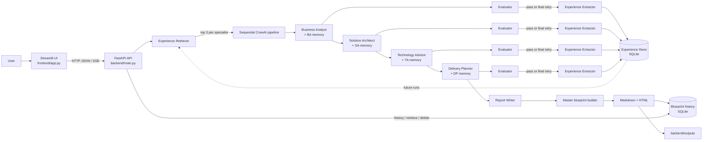
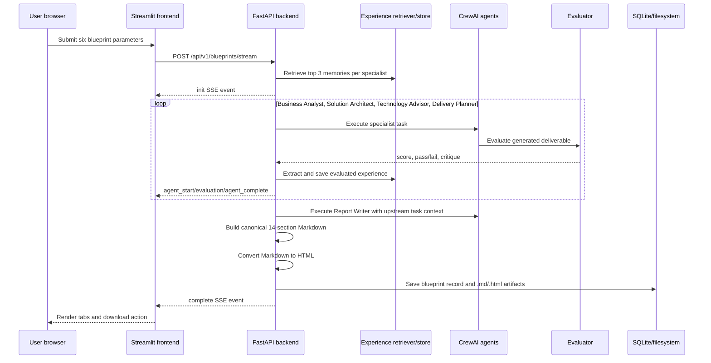

# MindMesh

## AI Solution Architecture Blueprint Engine

MindMesh is a full-stack, multi-agent architecture-planning application. It accepts a plain-language product idea and a small set of delivery constraints, then uses a sequential CrewAI workflow to produce an enterprise-style solution blueprint.

The generated blueprint combines:

- Business analysis and MVP scope
- Functional and non-functional requirements
- High-level system architecture and component interactions
- Technology-stack recommendations and trade-offs
- Implementation workstreams, team roles, milestones, and effort
- Testing, deployment, risk, compliance, and future-evolution guidance

The application is intended for product owners, founders, business analysts, solution architects, engineering managers, technical consultants, and delivery teams who need a structured starting point for architecture and delivery planning before implementation begins.

> **Important:** MindMesh generates architecture recommendations. It does not replace security review, compliance/legal advice, capacity testing, cost validation, or an implementation team's technical judgment.

---

## Table of contents

1. [What the project does](#what-the-project-does)
2. [Architecture at a glance](#architecture-at-a-glance)
3. [Technology stack](#technology-stack)
4. [Repository structure](#repository-structure)
5. [Prerequisites](#prerequisites)
6. [Installation and configuration](#installation-and-configuration)
7. [Running the application](#running-the-application)
8. [Using the application](#using-the-application)
9. [Multi-agent execution pipeline](#multi-agent-execution-pipeline)
10. [Experience memory](#experience-memory)
11. [API contract](#api-contract)
12. [Persistence and generated files](#persistence-and-generated-files)
13. [Configuration reference](#configuration-reference)
14. [Development notes](#development-notes)
15. [Troubleshooting](#troubleshooting)
16. [Limitations and production considerations](#limitations-and-production-considerations)

---

## What the project does

At a high level, a user:

1. Describes a proposed product, its users, features, and business workflow.
2. Selects a preferred technology ecosystem and cloud platform.
3. Selects an expected traffic/scale range.
4. Sets a delivery timeline and data-hosting jurisdiction.
5. Starts blueprint generation.
6. Watches the five specialist agents execute in real time.
7. Reviews the final blueprint in HTML and section-specific tabs.
8. Downloads the HTML report or reopens/deletes previous runs from the history sidebar.

The frontend defaults to `http://localhost:8000` for the backend. The backend exposes both a synchronous JSON endpoint and an SSE streaming endpoint; the Streamlit UI uses the streaming endpoint so that users can see agent progress and quality-gate events as they happen.

## Architecture at a glance



The diagram represents the implemented learning loop: an initial run has no (or few) memories; each evaluated specialist result becomes a structured experience; later runs retrieve relevant experiences and inject them into specialist prompts. Memory is advisory context, not an automatic decision override.

### Runtime request flow



### Service boundaries

| Service | Location | Default address | Responsibility |
| --- | --- | --- | --- |
| Frontend | `frontend/` | `http://localhost:8501` | Streamlit form, progress UI, history sidebar, report viewer |
| Backend | `backend/` | `http://localhost:8000` | FastAPI routes, agent orchestration, evaluation, persistence |
| LLM providers | Configured externally | External API | Generate specialist and evaluation responses |
| Search provider | Serper.dev | External API | Web search tool available to specialist agents |
| Local storage | `backend/db/`, `backend/outputs/` | Local filesystem | Blueprint history, accumulated experiences, and exported artifacts |

## Technology stack

### Frontend

- **Python 3.11+**
- **Streamlit** for the interactive web interface
- Python standard-library `urllib` client for backend HTTP calls
- Server-Sent Events (SSE) parsing for live generation progress
- Custom CSS in `frontend/styles.py`

### Backend

- **FastAPI** for the HTTP API and OpenAPI documentation
- **Pydantic v2** for request validation and settings
- **Uvicorn/FastAPI CLI** for local development serving
- **CrewAI** for agent/task/crew orchestration
- **Google Gemini through CrewAI/LiteLLM integration** for agent generation
- **CrewAI Tools / SerperDevTool** for web search
- **SQLite** through Python's `sqlite3` module for history
- Deterministic structured experience memory for cross-run reuse
- **Markdown** conversion to downloadable HTML

### Workspace and dependency management

- **uv** manages the Python environment and lockfile.
- The repository root is a uv workspace whose members include `backend`.
- `uv.lock` records resolved dependency versions.
- The backend has its own `backend/pyproject.toml`; the root project declares the frontend and workspace-level dependencies.

## Repository structure

```text
mindmesh/
├── frontend/
│   ├── app.py                  # Streamlit entry point and UI state router
│   ├── api_client.py           # Health, generation, history, retrieve, delete calls
│   ├── constants.py            # Presets, select-box options, agent metadata
│   ├── styles.py               # Frontend design system/CSS
│   ├── components/
│   │   ├── header.py            # Hero header and backend status
│   │   └── sidebar.py           # Saved blueprint history
│   └── views/
│       ├── form_view.py         # Six-parameter input form and validation
│       ├── execution_view.py   # Live SSE progress display
│       └── dashboard_view.py   # HTML report and section tabs
├── backend/
│   ├── main.py                 # FastAPI application and route registration
│   ├── pyproject.toml          # Backend dependency manifest
│   ├── .env.example            # Required environment-variable template
│   ├── src/
│   │   ├── config.py           # Pydantic settings loaded from .env
│   │   ├── crew.py             # Standard five-agent CrewAI crew
│   │   ├── pipeline.py         # Streaming execution and evaluation gates
│   │   ├── evaluation.py       # Evaluator invocation and score parsing
│   │   ├── blueprint_builder.py# Canonical 14-section report composition
│   │   ├── memory/
│   │   │   ├── models.py       # Experience dataclass
│   │   │   ├── experience_retriever.py # Structured relevance scoring
│   │   │   ├── experience_extractor.py # Evaluated output to experience
│   │   │   └── experience_store.py # Experience SQLite CRUD
│   │   ├── llm.py              # Per-agent model/key construction
│   │   ├── tools.py            # Shared Serper search tool
│   │   ├── db.py               # SQLite schema and CRUD/history sync
│   │   ├── routes/
│   │   │   ├── blueprint.py    # Blueprint API contract
│   │   │   └── health.py       # Health endpoints
│   │   ├── agents/             # Agent definitions, prompts, and task factories
│   │   └── utils/              # HTML conversion, file output, section parsing
│   ├── db/mindmesh.db          # Local SQLite database (created/updated at runtime)
│   └── outputs/                # Generated Markdown and HTML files
├── pyproject.toml              # Root project and uv workspace configuration
├── uv.lock                     # Locked dependency graph
└── README.md
```

## Prerequisites

Install the following before starting:

- Python **3.11 or newer**
- [uv](https://docs.astral.sh/uv/) installed and available on `PATH`
- Internet access for package installation and LLM/search API calls
- A Gemini API key for each configured agent role
- A Serper.dev API key

On Windows PowerShell, verify the tools:

```powershell
python --version
uv --version
```

## Installation and configuration

### 1. Install dependencies

From the repository root:

```powershell
cd C:\Users\rahul\OneDrive\Desktop\CTS\mindmesh
uv sync
```

`uv sync` creates or updates the uv-managed environment and installs the root project plus the backend workspace dependencies from the lockfile. If you only want to prepare the backend environment, run the same command from `backend`.

The frontend command uses `uvx streamlit`, which can provision Streamlit in an isolated uv tool environment. Running `uv sync` first is still recommended because it makes the project environment reproducible and ensures the workspace dependencies are available.

### 2. Create the backend environment file

Copy the template:

```powershell
Copy-Item backend\.env.example backend\.env
```

Open `backend\.env` and replace every placeholder with a real value. At minimum, the application settings require:

- `GEMINI_API_KEY_BA`
- `GEMINI_API_KEY_SA`
- `GEMINI_API_KEY_TA`
- `GEMINI_API_KEY_DP`
- `GEMINI_API_KEY_RW`
- `GEMINI_API_KEY_EV`
- `SERPER_API_KEY`

Do not commit `backend\.env` or expose API keys in the frontend. The frontend only calls the local backend; provider credentials are loaded by the backend.

### 3. Optional model and runtime configuration

The `.env.example` file includes defaults for each role's model, retries, evaluation, timeout, and logging. Keep the model names compatible with the configured CrewAI/LiteLLM provider. See [Configuration reference](#configuration-reference).

## Running the application

Run the backend and frontend in **separate terminals**.

### Terminal 1: start the backend

```powershell
cd C:\Users\rahul\OneDrive\Desktop\CTS\mindmesh\backend
uv run fastapi dev main.py
```

The API should be available at:

- Application: `http://localhost:8000`
- OpenAPI Swagger UI: `http://localhost:8000/docs`
- ReDoc: `http://localhost:8000/redoc`
- Health check: `http://localhost:8000/health`

### Terminal 2: start the frontend

```powershell
cd C:\Users\rahul\OneDrive\Desktop\CTS\mindmesh\frontend
uvx streamlit run app.py
```

Open the URL printed by Streamlit, normally `http://localhost:8501`.

The frontend's API base URL is initialized in `frontend/app.py` as `http://localhost:8000`. If the backend runs elsewhere, update that value or provide a configuration mechanism before deploying the frontend to another environment.

## Using the application

### Input fields

The form in `frontend/views/form_view.py` sends one JSON object with six required fields:

| Field | Type | Meaning | UI constraints/examples |
| --- | --- | --- | --- |
| `business_idea` | string | Product concept, users, features, and workflow | The UI asks for at least 15 non-whitespace characters |
| `technology_preference` | string | Preferred technology ecosystem | Open-Source Stack, Enterprise Stack, Microservices Mesh, Serverless Ecosystem, or No Preference |
| `cloud_preference` | string | Primary hosting preference | AWS, GCP, Azure, Multi-Cloud, On-Premises, or No Preference |
| `expected_daily_traffic` | string | Expected scale profile | 10,000 DAU, 50,000 DAU, 100,000 DAU, or 1,000,000+ DAU |
| `delivery_timeline_months` | integer | Target MVP delivery duration | UI range is 1–36 months |
| `data_hosting_country` | string | Data residency/jurisdiction target | United States, India, Germany/EU, Singapore, UK, or Global Multi-Region |

Preset templates are available for HealthTech, FinTech, and Smart Logistics/Fleet use cases. They are convenience values only; all fields can be changed before submission.

### Output

Each successful run produces:

- A short `run_id` (the first 12 characters of a UUID)
- A canonical Markdown blueprint
- A styled HTML blueprint
- A SQLite history record
- `backend/outputs/{run_id}.md`
- `backend/outputs/{run_id}.html`

The canonical report contains these 14 sections:

1. Delivery Overview
2. Business / MVP Scope and Priorities
3. Recommended Technology Stack
4. Implementation Workstreams
5. Recommended Team and Roles
6. Delivery Timeline and Milestones
7. Effort & Complexity Assessment
8. Dependencies and Prerequisites
9. High-Level Solution Architecture
10. Testing & Quality Strategy
11. Deployment & Release Strategy
12. Delivery Risks & Mitigations
13. Future Evolution
14. Assumptions & Open Questions

The dashboard exposes the full HTML report and tabs for Business Analysis, System Architecture, Technology Stack & Trade-offs, and Delivery Roadmap.

## Multi-agent execution pipeline

The standard crew in `backend/src/crew.py` is sequential. The streaming implementation in `backend/src/pipeline.py` adds an experience-memory layer around the first four specialist stages. Each downstream task also receives the relevant upstream CrewAI task context:

| Order | Agent | Primary responsibility |
| --- | --- | --- |
| 1 | Business Analyst | Stakeholders, goals, functional requirements, non-functional requirements, MVP scope; receives retrieved BA memories |
| 2 | Solution Architect | Components, data flows, security perimeter, scalability, architecture topology; receives retrieved SA memories and BA task context |
| 3 | Technology Advisor | Technology choices, alternatives, trade-offs, operational implications; receives retrieved TA memories plus BA/SA task context |
| 4 | Delivery Planner | Workstreams, milestones, team shape, effort, risks, testing and release plan; receives retrieved DP memories plus upstream task context |
| 5 | Report Writer | Cross-discipline synthesis and authoritative executive blueprint; receives the upstream specialist task context |

For stages 1–4, the evaluator runs after each specialist deliverable when `ENABLE_EVALUATION=true`. If the score is below `EVALUATION_THRESHOLD`, the pipeline retries the agent up to `MAX_AGENT_RETRIES` times and appends evaluator remediation guidance to the task description. When a specialist passes, or when its final permitted retry is reached, the result is converted into an experience and saved to SQLite. The Report Writer is not independently evaluated or stored as an experience in the current implementation.

The final report is assembled by `build_master_blueprint`; it does not simply concatenate raw agent responses. Topic-specific extraction routes content into the 14 stable headings and converts the result to HTML.

## Experience memory

MindMesh implements a persistent, per-agent experience loop:

```text
Run 1
  User input
    -> retrieve relevant experiences (usually none)
    -> BA -> evaluator -> extract/save BA experience
    -> SA -> evaluator -> extract/save SA experience
    -> TA -> evaluator -> extract/save TA experience
    -> DP -> evaluator -> extract/save DP experience
    -> Report Writer -> final blueprint

Later run
  User input
    -> retrieve up to three relevant experiences for BA, SA, TA, and DP
    -> inject each memory set into its matching task prompt
    -> execute the same sequential pipeline
    -> save new evaluated experiences
    -> future runs have a larger memory pool
```

There is no special sixth-run code path: the sixth run behaves like every run after the first, except that more evaluated experiences may be available for retrieval. The quality of the retrieved context depends on the similarity of the current constraints and the scores/recency of stored lessons.

### Retrieval behavior

`backend/src/memory/experience_retriever.py` retrieves experiences for one agent at a time. It first loads candidate records for the matching `agent_name`, then applies deterministic structured scoring:

- Exact cloud preference: +3; stored `No Preference`: +1
- Technology preference substring match: +2
- Exact data-hosting-country match: +2
- Exact delivery-timeline match: +2; within two months: +1
- Exact expected-traffic match: +2
- Successful experience: +3; failed experience: -1
- Evaluator score: added as a numeric tie-break/quality contribution

Candidates are sorted by total score and the top three are formatted into a compact prompt section. This is structured retrieval, not semantic search: there are currently no embeddings, vector database, cosine similarity, or business-idea text similarity calculations. The `business_idea` is stored with each experience for traceability, but it is not currently used by the retrieval scoring algorithm.

### Prompt usage and safeguards

The retrieved lessons are supplied to the task factories through `relevant_experience`. Specialist prompts explicitly instruct agents to:

- Treat memories as reference material rather than absolute rules.
- Prefer the current user's requirements and constraints.
- Reject a past decision when it conflicts with the current project.
- Pay attention to successful patterns, failed approaches, evaluator feedback, and reusable lessons.

This prevents historical output from silently overriding the current request.

### Experience extraction

`experience_extractor.py` performs deterministic extraction; it does not make another LLM call. For each stored specialist result it records:

- Source `run_id` and `agent_name`
- `successful_pattern` when the evaluation passes, otherwise `failed_attempt`
- All current project constraints
- Evaluator score and combined summary/critique/remediation feedback
- The specialist's output as the reusable lesson
- A boolean `successful` flag

An empty agent output is not stored. Experience-save failures are logged as warnings and do not abort the blueprint run.

### Experience storage schema

Experiences are stored in the SQLite `experiences` table alongside blueprint history:

| Column | Meaning |
| --- | --- |
| `run_id` | Run that produced the lesson |
| `agent_name` | Specialist that produced it |
| `experience_type` | `successful_pattern` or `failed_attempt` |
| `business_idea` | Original project description |
| `technology_preference` | Technology constraint |
| `cloud_preference` | Cloud constraint |
| `expected_daily_traffic` | Scale constraint |
| `delivery_timeline_months` | Timeline constraint |
| `data_hosting_country` | Residency constraint |
| `decision` | Reserved decision field; currently usually empty |
| `reason` | Combined evaluator feedback |
| `evaluator_score` | Numeric quality score |
| `evaluator_feedback` | Persisted evaluator summary |
| `reusable_lesson` | Specialist output used as future prompt context |
| `successful` | `1` for passed, `0` for failed/final-retry output |
| `created_at` | Experience creation timestamp |

Indexes exist for agent, experience type, cloud, creation time, and evaluator score. The current store query filters by agent (and supports an experience-type parameter), orders by evaluator score and recency, and the retriever applies the remaining relevance scoring in Python.

## API contract

The backend registers the health router at both the root and `/api/v1` prefixes, and registers blueprint routes under `/api/v1/blueprints`.

### Base URLs

```text
http://localhost:8000
http://localhost:8000/api/v1
```

FastAPI also publishes the interactive contract at `/docs` and the machine-readable schema at `/openapi.json`.

### Request schema: `BlueprintRequest`

```json
{
  "business_idea": "An online platform for booking home healthcare services",
  "technology_preference": "Open-Source Stack",
  "cloud_preference": "AWS",
  "expected_daily_traffic": "10,000 DAU (Standard MVP Scale)",
  "delivery_timeline_months": 3,
  "data_hosting_country": "India"
}
```

Pydantic validates the JSON shape and primitive types. Business-level option validation is primarily performed in the Streamlit form; API clients should still send meaningful, non-empty values.

### `GET /health` and `GET /api/v1/health`

Returns a lightweight liveness response:

```json
{
  "status": "ok"
}
```

The frontend tries `/health`, `/api/v1/health`, and `/api/v1/blueprints/list` when checking connectivity.

### `POST /api/v1/blueprints` or `/api/v1/blueprints/generate`

Runs the standard asynchronous CrewAI kickoff, waits for completion, persists the result, and returns JSON.

**Success:** HTTP `201 Created`

```json
{
  "run_id": "efc2fc1f-032",
  "status": "completed",
  "file_saved": "outputs/efc2fc1f-032.html",
  "markdown": "# Enterprise Solution Blueprint\n...",
  "result": "<!DOCTYPE html>..."
}
```

- `run_id`: identifier used by history, retrieval, and deletion endpoints.
- `file_saved`: relative HTML artifact path.
- `markdown`: canonical report source.
- `result`: generated HTML presentation.

**Failure:** HTTP `500`

```json
{
  "detail": "Blueprint generation failed: <provider or pipeline error>"
}
```

### `POST /api/v1/blueprints/stream`

Runs the same five-agent process but returns `text/event-stream`. Each message is an SSE record with a JSON object after `data:`.

Example:

```text
data: {"event":"init","run_id":"efc2fc1f-032","message":"Initialized autonomous multi-agent pipeline with quality evaluation gates.","progress":3}

data: {"event":"agent_start","agent":"Business Analyst","step":1,"total":5,"role":"Requirements & MVP Scope Analyst","message":"...","progress":5}

data: {"event":"evaluation","agent":"Business Analyst","step":1,"score":0.86,"passed":true,"summary":"...","critique":[],"remediation":"None","message":"Evaluator Score: 0.86 — Accepted","progress":11}

data: {"event":"agent_complete","agent":"Business Analyst","step":1,"total":5,"output":"...","message":"...","progress":22}

data: {"event":"complete","run_id":"efc2fc1f-032","status":"completed","progress":100,"markdown":"...","html":"...","sections":{}}
```

#### SSE event types

| Event | Purpose | Important fields |
| --- | --- | --- |
| `init` | Pipeline created | `run_id`, `message`, `progress` |
| `agent_start` | Agent began work | `agent`, `step`, `total`, `role`, `message`, `progress` |
| `evaluation_start` | Quality gate began | `agent`, `step`, `message`, `progress` |
| `evaluation` | Quality score returned | `agent`, `step`, `score`, `passed`, `summary`, `critique`, `remediation`, `progress` |
| `agent_retry` | Below-threshold result is being regenerated | `agent`, `step`, `retry_count`, `message`, `progress` |
| `agent_complete` | Agent deliverable completed | `agent`, `step`, `output`, `message`, `progress` |
| `complete` | Final report built and saved | `run_id`, `status`, `markdown`, `html`, `sections`, `progress` |
| `error` | Pipeline failed | `run_id`, `error`, `message` |

On `complete`, the backend saves the record to SQLite and writes both Markdown and HTML files. On an execution exception, the stream emits an `error` event rather than returning a normal JSON response.

### `GET /api/v1/blueprints`, `/list`, or `/history`

Returns up to 100 history entries:

```json
{
  "total": 1,
  "run_ids": ["efc2fc1f-032"],
  "history": [
    {
      "id": 1,
      "run_id": "efc2fc1f-032",
      "created_at": "2026-09-20 14:45:00",
      "business_idea": "An online platform...",
      "technology_preference": "Open-Source Stack",
      "cloud_preference": "AWS",
      "expected_daily_traffic": "10,000 DAU (Standard MVP Scale)",
      "delivery_timeline_months": 3,
      "data_hosting_country": "India",
      "status": "completed"
    }
  ]
}
```

If the database has no records but output files exist, the endpoint can discover HTML files from `backend/outputs` as a filesystem fallback.

### `GET /api/v1/blueprints/{run_id}`

Returns a saved blueprint from SQLite first, then falls back to `{run_id}.md` and `{run_id}.html` in `backend/outputs`.

```json
{
  "run_id": "efc2fc1f-032",
  "status": "completed",
  "result": "<!DOCTYPE html>...",
  "markdown": "# Enterprise Solution Blueprint\n...",
  "html": "<!DOCTYPE html>...",
  "sections": {
    "business_analyst": "...",
    "solution_architect": "...",
    "technology_advisor": "...",
    "delivery_planner": "..."
  },
  "created_at": "2026-09-20 14:45:00",
  "business_idea": "An online platform...",
  "technology_preference": "Open-Source Stack",
  "cloud_preference": "AWS"
}
```

If the run does not exist, the endpoint returns HTTP `404`:

```json
{
  "detail": "Blueprint output for run_id 'unknown-id' not found."
}
```

### `DELETE /api/v1/blueprints/{run_id}`

Deletes the SQLite record and any matching `.md`/`.html` files.

**Success:** HTTP `200`

```json
{
  "run_id": "efc2fc1f-032",
  "status": "deleted",
  "message": "Successfully deleted blueprint efc2fc1f-032 from SQLite and storage."
}
```

The reserved `final_output` artifact cannot be deleted and returns HTTP `400`. A missing run returns HTTP `404`.

### CORS

The backend currently enables all origins, methods, and headers to support local Streamlit/Vite-style clients. This is convenient for development but should be narrowed to known frontend origins before production deployment.

## Persistence and generated files

The SQLite database is `backend/db/mindmesh.db`. It stores two related but distinct kinds of data.

The `blueprints` table stores:

- Numeric database ID
- Unique `run_id`
- Creation timestamp
- All six request inputs
- Markdown and HTML content
- Status

The `experiences` table stores evaluated lessons from the Business Analyst, Solution Architect, Technology Advisor, and Delivery Planner stages. These records are internal pipeline memory; there are currently no public REST endpoints for browsing, editing, or deleting individual experiences. They are read during a new generation run and written automatically during the SSE pipeline.

The filesystem copy in `backend/outputs` is intentionally maintained as a fallback/export path:

```text
backend/outputs/
├── <run_id>.md
├── <run_id>.html
├── final_output.md
└── final_output.html
```

The database module initializes both tables and their indexes on import, and can backfill Markdown files that exist without database rows. Treat the local database and output directory as application data; back them up or replace them with managed storage for a multi-instance deployment. Blueprint deletion removes the selected blueprint record and its output files; it does not remove experiences associated with that run, so learned history remains available to later runs.

## Configuration reference

All backend settings are loaded from `backend/.env` through `pydantic-settings`.

| Variable | Required | Default/example | Purpose |
| --- | --- | --- | --- |
| `APP_NAME` | No | `MindMesh API` | FastAPI title |
| `GEMINI_API_KEY_BA` | Yes | placeholder | Business Analyst credential |
| `GEMINI_API_KEY_SA` | Yes | placeholder | Solution Architect credential |
| `GEMINI_API_KEY_TA` | Yes | placeholder | Technology Advisor credential |
| `GEMINI_API_KEY_DP` | Yes | placeholder | Delivery Planner credential |
| `GEMINI_API_KEY_RW` | Yes | placeholder | Report Writer credential |
| `GEMINI_API_KEY_EV` | Yes | placeholder | Evaluator credential |
| `BA_MODEL` | Yes | Gemini model name | Business Analyst model |
| `SA_MODEL` | Yes | Gemini model name | Solution Architect model |
| `TA_MODEL` | Yes | Gemini model name | Technology Advisor model |
| `DP_MODEL` | Yes | Gemini model name | Delivery Planner model |
| `RW_MODEL` | Yes | Gemini model name | Report Writer model |
| `EVALUATION_MODEL` | Yes | Gemini model name | Evaluator model |
| `SERPER_API_KEY` | Yes | placeholder | Serper search tool credential |
| `MAX_AGENT_RETRIES` | No | `2` | Maximum remediation retries per evaluated step |
| `ENABLE_EVALUATION` | No | `true` | Enables evaluator quality gates |
| `EVALUATION_THRESHOLD` | No | `0.70` | Minimum score required to pass |
| `AGENT_TIMEOUT_SECONDS` | No | `120` | Configured agent runtime budget |
| `LOG_LEVEL` | No | `INFO` | Application logging setting |

## Development notes

### Adding or changing an agent

An agent is split into three concerns under `backend/src/agents/<agent_name>/`:

- `agent.py`: CrewAI `Agent` construction and model/tool wiring
- `prompt.py`: role-specific behavior and output guidance
- `task.py`: task inputs, expected output, and context dependencies

After adding an agent, update the crew ordering in `src/crew.py`, the streaming pipeline in `src/pipeline.py`, the frontend metadata in `frontend/constants.py`, and the event rendering logic in `frontend/views/execution_view.py`.

### Changing experience memory

Memory behavior is split across `backend/src/memory/`:

- Change the `Experience` shape in `models.py` and the matching SQLite schema in `src/db.py` together.
- Change candidate loading or persistence in `experience_store.py`.
- Change relevance scoring or prompt formatting in `experience_retriever.py`.
- Change deterministic conversion of evaluation results in `experience_extractor.py`.
- Update the four task factories and `pipeline.py` if a new specialist should receive or save memory.

If adding semantic retrieval later, preserve the current structured constraints as filters or ranking signals, and document the embedding model, index lifecycle, privacy implications, and fallback behavior.

### Changing the report contract

The report structure is centralized in `src/blueprint_builder.py`. If headings change, update the corresponding extraction patterns in:

- `backend/src/utils/section_parser.py`
- `frontend/views/dashboard_view.py`

This keeps API `sections`, dashboard tabs, and generated Markdown aligned.

### API exploration

FastAPI generates the current runtime contract:

```text
http://localhost:8000/docs
http://localhost:8000/openapi.json
```

Use these endpoints as the final authority when the implementation and this document diverge.

## Troubleshooting

### Frontend says “Backend unreachable”

1. Confirm the backend terminal is running.
2. Open `http://localhost:8000/health`.
3. Confirm the frontend is using the same host/port configured in `frontend/app.py`.
4. Check that Windows Firewall or another process is not blocking port 8000.

### Backend fails while importing settings

`src/config.py` requires all API-key and model variables without defaults. Ensure `backend/.env` exists and contains every required variable from `backend/.env.example`.

### Blueprint generation fails with a provider error

Check:

- Provider API keys are valid and have quota.
- Model names are supported by the installed CrewAI/LiteLLM integration.
- The machine has outbound internet access.
- Serper is available if an agent invokes web search.
- The terminal output for the underlying CrewAI/provider exception.

The API returns a `500` for synchronous failures and emits an SSE `error` event for streaming failures.

### History is empty or a report cannot be reopened

The backend uses paths relative to its working directory for the API's filesystem fallback. Start the backend from the `backend` directory using the documented command. Also confirm that `backend/db/mindmesh.db` and `backend/outputs` are writable.

### The generated report is slow

Five agents may each invoke an LLM and an evaluator may add another LLM call after each step. Reduce `MAX_AGENT_RETRIES`, temporarily set `ENABLE_EVALUATION=false` for local diagnosis, or use smaller/faster provider models. Re-enable evaluation before relying on results.

## Limitations and production considerations

- **Local-only persistence:** SQLite and local files are suitable for a single development instance, not concurrent horizontally scaled workers.
- **Open CORS policy:** Replace `allow_origins=["*"]` with an explicit allowlist.
- **Secrets:** Store provider keys in a secret manager in production; never place them in source control or frontend code.
- **Authentication:** The current API has no authentication or authorization layer.
- **Rate limiting:** The current API does not enforce per-user or per-IP generation quotas.
- **Long-running requests:** LLM generation can take minutes. Production deployments should consider a job queue, durable job state, worker processes, and reconnectable progress streams.
- **Observability:** Add structured logs, correlation IDs, provider metrics, token/cost tracking, and error monitoring before operating at scale.
- **Output validation:** Generated architecture should be reviewed by qualified engineers and validated with threat modeling, load testing, cost estimation, and jurisdiction-specific compliance checks.
- **Provider coupling:** The current implementation constructs Gemini-backed LLMs and uses Serper; swapping providers requires changes to model configuration and possibly the CrewAI integration.
- **Data handling:** User business ideas and generated reports are sent to configured external model/search providers. Review provider retention, privacy, and residency terms before using sensitive or regulated information.
- **Memory is structured, not semantic:** Experience retrieval currently ranks by agent, cloud, technology, traffic, timeline, residency, success, score, and recency. It does not find conceptually similar business ideas.
- **Memory retention:** Experiences persist after blueprint deletion. Add an explicit retention, purge, export, and privacy policy before using the feature with sensitive project data.
- **Report Writer evaluation boundary:** The four specialist stages have evaluation-backed memory; the final Report Writer output is assembled and saved but is not independently evaluated into memory.

## License

No license file is currently included in the repository. Add an explicit license before distributing MindMesh outside the owning organization.