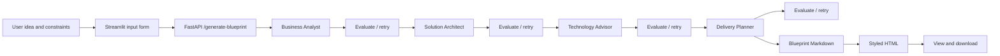

# SolutionForge AI

> Turn a business idea and delivery constraints into a decision-oriented solution blueprint.

SolutionForge AI is a CrewAI-based multi-agent consulting assistant for the early stage of technical discovery. It combines business analysis, architecture, technology selection, and delivery planning into one structured report that a business or engineering team can use as a starting point.

The hackathon MVP is intentionally focused: capture the problem and constraints, run four specialized agents in sequence, and produce a viewable/downloadable HTML blueprint backed by the original Markdown output.

## Why it matters

Business teams often have a promising idea but no fast, repeatable way to answer:

- What is the smallest useful MVP?
- What architecture and technologies fit the expected scale?
- What can a six-person team deliver within the stated timeline?
- Which assumptions, dependencies, and risks need technical discovery?

SolutionForge AI automates this early-stage consulting workflow without pretending that the generated blueprint replaces detailed discovery or implementation design.

## MVP features

- Streamlit form for:
  - Business idea/problem
  - Technology preference: open-source or enterprise
  - Cloud preference: AWS, Azure, GCP, or none
  - Expected daily traffic
  - Delivery timeline in months
  - Country for data hosting
- FastAPI endpoint that runs a sequential four-agent CrewAI workflow.
- Context passed from Business Analyst to Solution Architect to Technology Advisor to Delivery Planner.
- Structured consulting-style blueprint covering scope, stack, workstreams, timeline, risks, and future evolution.
- Per-agent evaluation gates that can retry unsatisfactory outputs before passing context downstream.
- Tavily-backed web research for role-specific fact checking and source-aware recommendations.
- Structured execution logs for agent inputs, outputs, evaluations, retries, and failures.
- Markdown source converted to a styled HTML report.
- HTML report displayed in the UI and available for download.
- Input validation and backend error handling.
- Tavily-backed role-specific research with source URLs and evidence.

## How it works



The crew is sequential. Each agent receives the relevant outputs from the agents before it, researches role-specific facts with Tavily when enabled, and must pass an evaluation gate before its output is handed downstream. Failed evaluations trigger a bounded retry with feedback. CrewAI's sequential process and the surrounding Python orchestration provide coordination; a separate coordinator agent is not required for this MVP. The Technology Advisor is the authoritative source for technology choices; the Delivery Planner uses that agreed stack rather than independently introducing alternatives.

These safeguards improve reliability but do not guarantee that every recommendation is correct. Tavily provides external evidence, evaluators enforce role-specific quality criteria, deterministic validators check structure and consistency, and bounded retries improve failed outputs. Human review remains the final safeguard for business assumptions, security, compliance, cost, data residency, and timeline decisions.

### Agent pipeline

1. **Business Analyst** — identifies users, stakeholders, functional and non-functional requirements, MVP versus future scope, assumptions, constraints, and risks.
2. **Solution Architect** — translates requirements into architecture style, components, data flow, storage, security, scalability, and an MVP-first evolution path.
3. **Technology Advisor** — recommends specific technologies, evaluates open-source versus enterprise options, respects cloud preference, and explains trade-offs, risks, complexity, and lock-in.
4. **Delivery Planner** — turns the preceding context into workstreams, roles, milestones, dependencies, testing/deployment approach, risks, and future evolution.

Every recommendation must include rationale, trade-offs, and risks. The output should be internally consistent and proportionate to the stated scope and timeline.

## Confirmed technology stack

| Area | Choice | Purpose |
| --- | --- | --- |
| Orchestration | CrewAI | Sequential agents and context handoff |
| Application language | Python | CrewAI, API, and report-processing implementation |
| LLM access | CrewAI LLM integration via OpenRouter | Hackathon access to free-tier models |
| Backend | FastAPI | Validated API endpoint and error handling |
| Frontend | Streamlit | Input form, progress display, report rendering, download |
| Report format | Markdown → styled HTML | Readable source plus viewable/downloadable result |
| Research and verification | Tavily API | Role-specific web research with source URLs and evidence |
| Evaluation and observability | Python evaluators + structured logs | Quality gates, bounded retries, and debugging |
| Runtime | Local development; optional container/cloud deployment | Fast hackathon setup with a path to deployment |

## Setup

### Prerequisites

- Python 3.11+ recommended.
- An OpenRouter API key.
- The repository checked out locally.
- A Tavily API key for role-specific web research and source verification.

### Install

```powershell
python -m venv .venv
.\.venv\Scripts\Activate.ps1
pip install -r requirements.txt
```

Create a `.env` file (never commit it):

```env
OPENROUTER_API_KEY=your_openrouter_key
OPENROUTER_MODEL=your_free_tier_model
TAVILY_API_KEY=your_tavily_key
ENABLE_TAVILY_RESEARCH=true
MAX_AGENT_RETRIES=2
LOG_LEVEL=INFO
```

The exact free-tier model is selected through configuration so the team can use an available OpenRouter model during the hackathon. Tavily research and retry limits should remain configurable so the core workflow can still be tested with mocks or when a provider is unavailable.

## Run locally

Start the API in one terminal:

```powershell
uvicorn app.main:app --reload --port 8000
```

Start Streamlit in another:

```powershell
streamlit run streamlit_app.py
```

Open the Streamlit URL printed by the command, normally `http://localhost:8501`. The API's interactive documentation is available at `http://localhost:8000/docs`.

If the application is containerized later, keep the same logical API and UI boundaries; container/cloud deployment is optional for the MVP.

## Demo walkthrough

Use any business idea and its real delivery constraints. For a judge demo, enter a sufficiently detailed problem statement that names the users, desired outcome, approximate scale, timeline, and important constraints. Then choose the technology preference, cloud preference, expected daily traffic, delivery timeline, and data-hosting country.

For example, a demo input can describe:

> A business needs a customer-facing platform to replace a manual operational process. Users need to submit requests, track status, and receive notifications; internal staff need to review and manage those requests. The team needs a production-ready MVP within the stated timeline.

The domain, users, workflows, scale, timeline, cloud, technology preference, and data-hosting country should come from the scenario being tested, not from a hard-coded domain fixture.

Click **Generate Blueprint**. The UI should show agent progress in order, then render the report and offer an HTML download. The generated recommendations should reflect the submitted idea and constraints rather than returning a generic technology list.

## Sample output snippet

```markdown
# Solution Blueprint

## Delivery Overview
- Production-ready MVP for the submitted business idea
- Delivery plan sized to the submitted traffic and timeline
- Architecture and hosting recommendations aligned to the submitted constraints

## Recommended Technology Stack
- Specific recommendations selected for the submitted requirements
- Open-source or enterprise choices evaluated against the stated preference
- Cloud choices aligned to the submitted cloud and data-hosting constraints

## Delivery Risks & Mitigations
- Domain-specific consistency and concurrency risks identified from the submitted workflows
- Data protection, access control, auditability, and operational risks addressed for the submitted context
```

The exact technologies and wording are generated by the crew; the snippet illustrates the expected decision-oriented shape, not a hard-coded report.

### Trust model

The blueprint is a starting point for technical discovery, not an automatically approved production architecture. Agents should distinguish sourced facts from assumptions, preserve relevant source URLs, and identify uncertainty or conflicting evidence. A final human review is required before implementation decisions are treated as authoritative.

## Report contract

Every final blueprint should include:

1. Delivery Overview
2. Business/MVP Scope & Priorities
3. Recommended Technology Stack
4. Implementation Workstreams
5. Recommended Team & Roles
6. Delivery Timeline & Milestones
7. Effort & Complexity Assessment
8. Dependencies & Prerequisites
9. High-Level Architecture (text-based diagram)
10. Testing & Quality Strategy
11. Deployment & Release Strategy
12. Delivery Risks & Mitigations
13. Future Evolution
14. Assumptions & Open Questions

## Team

| Member | Focus |
| --- | --- |
| Member 1 | Business Analyst agent and requirements contract |
| Member 2 | Solution Architect agent |
| Member 3 | Technology Advisor agent |
| Member 4 | Delivery Planner agent |
| Member 5 | CrewAI orchestration and FastAPI integration |
| Member 6 | Streamlit frontend, testing, demo, and documentation coordination |

Names can be added by the team without changing the ownership boundaries.

## License

SolutionForge AI is intended to be released under the [MIT License](LICENSE). Add the repository's `LICENSE` file before public release if it is not already present.
