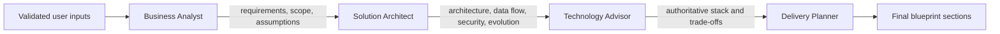
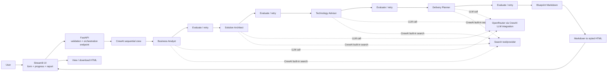

# SolutionForge AI — Internal Technical Design

**Status:** Hackathon MVP build specification  
**Audience:** Six-person implementation team  
**Scope:** Exactly the MVP described here, including bounded evaluation/retry gates, role-specific research through CrewAI's built-in search tool, and structured observability. Additional demo scenarios are stretch work.

## 1. Problem and objective

Business teams have an idea but no quick, structured way to turn it into an implementable technology solution. Architecture, technology selection, and delivery planning require multiple perspectives and are commonly performed manually.

SolutionForge AI automates that early-stage consulting workflow. Given a business idea and delivery constraints, it runs four specialized CrewAI agents in a strict sequence and produces a decision-oriented blueprint. The blueprint is a starting point for technical discovery, not a substitute for detailed requirements, security review, or production design.

CrewAI search, evaluators, deterministic validators, and bounded retries improve reliability but do not guarantee correctness. Search results may be irrelevant, stale, or conflicting, and evaluators can also miss issues. The system must distinguish sourced facts from assumptions, preserve evidence, surface uncertainty, and require human review before business, security, compliance, cost, data-residency, or timeline decisions are treated as authoritative.

### MVP objective

Build a working local application that:

1. Captures the six required user inputs.
2. Validates the inputs at the API boundary.
3. Runs Business Analyst → Solution Architect → Technology Advisor → Delivery Planner.
4. Researches relevant facts with CrewAI's built-in search tool and preserves source evidence where research is enabled.
5. Evaluates every agent output against role-specific quality criteria.
6. Retries an unsatisfactory agent output with evaluator feedback, up to a configured limit.
7. Passes only an accepted output downstream between agents.
8. Produces a blueprint with all required report sections.
9. Converts Markdown to styled HTML for viewing and downloading.
10. Surfaces backend and generation failures clearly and logs enough metadata to debug them.

Out of scope for the MVP: autonomous implementation, provisioning cloud infrastructure, replacing human architecture review, adding agents beyond the four defined here, and a separate coordinator agent. CrewAI's `Process.sequential` plus explicit Python orchestration is the coordinator for this workflow.

## 2. Target audience

- Business teams validating an idea before technical discovery.
- Founders and product managers who need a credible first solution direction.
- Small engineering teams planning an MVP against a fixed deadline.
- Hackathon judges evaluating whether recommendations adapt to constraints.

## 2.1 Repository and planned file structure

The repository is an early scaffold. The current root contains the workspace metadata and four planning documents; `backend/src/main.py` and `backend/src/tasks.py` are placeholders, `backend/src/agents/` is ready for agent modules, and `frontend/` is ready for the Streamlit entry point.

```text
mindmesh/
├── README.md
├── API_CONTRACTS.md
├── SOLUTION_BLUEPRINT.md
├── TODO.md
├── pyproject.toml
├── .python-version
├── backend/
│   ├── README.md
│   ├── pyproject.toml
│   └── src/
│       ├── main.py
│       ├── tasks.py
│       └── agents/
└── frontend/
```

The target implementation keeps this layout and adds:

```text
backend/src/
├── config.py
├── routes/
│   ├── health.py
│   └── blueprints.py
├── models.py
├── orchestration.py
├── research.py                  # CrewAI WebsiteSearchTool factory/configuration
├── evaluation.py
├── reporting.py
├── tasks.py
└── agents/
    ├── business_analyst.py
    ├── solution_architect.py
    ├── technology_advisor.py
    └── delivery_planner.py
frontend/
└── streamlit_app.py
```

No Tavily adapter, Tavily-specific settings module, or separate search microservice should be added.

The complete HTTP contract and route ownership are defined in `API_CONTRACTS.md`.

## 3. Domain-agnostic use case

The product must accept **any business idea**, not one fixed industry or workflow. The business idea field is the domain-specific source of truth. It may describe a customer-facing product, an internal workflow, a data platform, an operational tool, or another software-enabled business problem.

The constraints captured alongside the idea are:

- Technology preference: open-source or enterprise
- Cloud preference: AWS, Azure, GCP, or none
- Expected daily traffic
- Delivery timeline in months
- Country for data hosting
- The free-text business problem and desired outcome

Development fixtures should include multiple domains and deliberately vary scale, timeline, technology preference, cloud preference, and data-hosting country. No domain-specific scenario should be required for the application to work.

## 4. User input schema

The same contract is used by Streamlit, FastAPI, and test fixtures.

| Field | Type | Required | Validation / meaning |
| --- | --- | --- | --- |
| `business_idea` | string | Yes | Free text; reject blank input; contains the business problem, users, and desired outcome |
| `technology_preference` | enum | Yes | `open-source` or `enterprise` |
| `cloud_preference` | enum | Yes | `AWS`, `Azure`, `GCP`, or `none` |
| `expected_daily_traffic` | string | Yes | User-facing traffic estimate such as `~20,000 daily active users`; preserve the stated value for agent context |
| `delivery_timeline_months` | integer | Yes | Positive number of months |
| `data_hosting_country` | string | Yes | Country or jurisdiction for data hosting |

Reference request values:

```json
{
  "business_idea": "A business wants a production-ready MVP for a customer-facing platform that replaces a manual operational process. Customers need to submit requests, track status, and receive notifications; internal staff need to review and manage those requests.",
  "technology_preference": "open-source",
  "cloud_preference": "AWS",
  "expected_daily_traffic": "Approximately 20,000 daily active users",
  "delivery_timeline_months": 6,
  "data_hosting_country": "India"
}
```

## 5. Four-agent architecture

CrewAI is configured for a sequential process. Each task has one clear owner and receives the prior accepted task output as context. A non-agent orchestration layer owns research calls, evaluation, retry limits, logging, and failure handling. This is preferable to a coordinator LLM agent because control flow and quality policy should be deterministic and auditable.



### 5.1 Business Analyst

**Responsibility:** Understand the problem before proposing implementation.

**Must produce:**

- Users and stakeholders
- Functional requirements
- Non-functional requirements
- MVP scope versus future scope
- Assumptions, constraints, and risks
- Priority rationale tied to the timeline

**Draft role definition / prompt:**

```text
You are the Business Analyst for SolutionForge AI. Analyze the supplied business idea
and delivery constraints. Identify users and stakeholders, then extract functional and
non-functional requirements. Define a realistic MVP and explicitly separate future scope.
Record assumptions, constraints, risks, and open questions. Respect the stated traffic,
timeline, technology preference, cloud preference, and data-hosting country. Do not select
specific technologies yet. Return structured Markdown that a Solution Architect can use
as authoritative context. Be concise, decision-oriented, and explicit about uncertainty.
```

### 5.2 Solution Architect

**Responsibility:** Turn requirements into a proportionate architecture.

**Must produce:**

- Suitable architecture style and why
- Major MVP components and responsibilities
- High-level request/data flow
- Storage and data boundaries
- Security and privacy controls
- Scalability approach for the stated traffic
- MVP versus future evolution
- Explicitly avoided over-engineering

**Draft role definition / prompt:**

```text
You are the Solution Architect. Use the Business Analyst output as the requirements
source of truth. Propose an MVP-first architecture style, components, data flow, storage
boundaries, security controls, and scalability approach. Respect data residency, cloud
preference, traffic, and delivery timeline. Separate what is needed for the MVP from
future evolution and call out infrastructure that would be unjustified. Do not produce
an arbitrary technology shopping list; describe capabilities and constraints so the
Technology Advisor can make the concrete choices. Include rationale, trade-offs, and risks.
```

### 5.3 Technology Advisor

**Responsibility:** Make concrete technology choices and own the final stack.

**Must produce:**

- Specific recommended technologies
- Open-source versus enterprise evaluation
- Cloud services aligned to the stated cloud preference
- Scale, security, complexity, operational, and lock-in analysis
- Alternatives considered and rejected
- Rationale, trade-offs, and risks for each material choice

**Draft role definition / prompt:**

```text
You are the Technology Advisor and the single source of truth for technology choices.
Use the requirements and architecture context, then recommend a concrete stack. Honor
the user's cloud preference exactly: do not silently substitute another cloud. Honor the
open-source or enterprise preference while explaining exceptions required for delivery,
security, or operations. Evaluate scale, security, complexity, team fit, lock-in, and
timeline. Give one clear recommendation per major capability, with alternatives,
trade-offs, risks, and rationale. Keep the stack realistic for a production-ready
six-month MVP and do not introduce infrastructure without justification.
```

### 5.4 Delivery Planner

**Responsibility:** Convert the agreed requirements, architecture, and stack into an executable plan.

**Must produce:**

- Workstreams and sequencing
- Team roles and ownership
- Timeline and milestones within the supplied months
- Dependencies and prerequisites
- Testing and deployment approach
- Effort and complexity assessment
- Delivery risks and mitigations
- Future evolution tied to the earlier scope

**Draft role definition / prompt:**

```text
You are the Delivery Planner. Treat the Business Analyst, Solution Architect, and
Technology Advisor outputs as upstream decisions. Build a realistic implementation plan
for the stated timeline: workstreams, team roles, milestones, dependencies, risks,
testing, deployment, and release approach. Use the Technology Advisor's stack without
inventing a competing stack. Prioritize the MVP, identify critical path items, and
explain what must wait for future evolution. Keep requirements, architecture,
technology, and schedule internally consistent. Include effort and complexity reasoning.
```

## 6. Final report contract

The Delivery Planner (or a final report assembly step that preserves its content) must produce these headings in order:

1. Delivery Overview
2. Business/MVP Scope & Priorities
3. Recommended Technology Stack
4. Implementation Workstreams
5. Recommended Team & Roles
6. Delivery Timeline & Milestones
7. Effort & Complexity Assessment
8. Dependencies & Prerequisites
9. High-Level Architecture
10. Testing & Quality Strategy
11. Deployment & Release Strategy
12. Delivery Risks & Mitigations
13. Future Evolution
14. Assumptions & Open Questions

The final output must include a text-based architecture diagram. Markdown is retained as the source artifact; HTML is a presentation artifact.

## 7. Evaluation, research, retries, and observability

Each agent has a role-specific evaluation gate. Deterministic checks validate structure and constraints; an optional LLM-as-judge rubric assesses quality. The evaluator returns `accepted`, a score, failed criteria, and actionable feedback.

- **Business Analyst:** requirements are complete, stakeholders and priorities are explicit, and MVP/future scope is separated.
- **Solution Architect:** architecture follows requirements, is proportionate to scale, includes data flow/security, and avoids unjustified infrastructure.
- **Technology Advisor:** concrete choices have rationale, trade-offs, risks, and source evidence; cloud and technology preferences are respected.
- **Delivery Planner:** milestones fit the requested timeline, dependencies and roles are actionable, and the plan uses the accepted technology stack.

Only accepted output is handed downstream. An unsatisfactory result is retried with evaluator feedback, up to `MAX_AGENT_RETRIES`; exhaustion returns an explicit failure instead of an unverified blueprint.

CrewAI's built-in search tool is used for focused, role-specific research:

- Business Analyst: domain terminology, comparable workflows, and requirement considerations.
- Solution Architect: architecture patterns, scale, security, and data-residency constraints.
- Technology Advisor: official technology/cloud documentation, support status, limits, and alternatives.
- Delivery Planner: delivery practices, technology maturity, testing/deployment constraints, and timeline assumptions.

Research results are passed as titled excerpts with URLs and retrieval metadata. Prompts must distinguish sourced facts from assumptions. Search-tool failure is logged and handled explicitly; it must never silently create a source-shaped claim. The tool is attached directly to the relevant CrewAI agents, so no separate Tavily client, API wrapper, or custom search service is part of the MVP.

No separate coordinator agent is needed for the MVP. CrewAI's `Process.sequential` coordinates task order, while deterministic Python code coordinates search-tool execution, evaluation, retries, timeouts, and logging. A coordinator LLM would add another probabilistic decision-maker and could conflict with the Technology Advisor's single-source-of-truth responsibility.

Emit structured events for `run_started`, `agent_started`, `research_completed`, `agent_output`, `evaluation_completed`, `retry_requested`, `agent_accepted`, `agent_failed`, and `run_completed`. Include run ID, role, attempt, latency, evaluator score, failed criteria, and source count. Redact keys and avoid full user input or sensitive generated content by default.

## 8. System architecture and data flow



### Request lifecycle

1. Streamlit collects the six inputs and sends JSON to FastAPI.
2. Pydantic validation rejects missing, blank, invalid enum, or invalid timeline values.
3. FastAPI constructs one crew run with the validated input object.
4. Each role optionally researches with CrewAI's built-in search tool, then CrewAI executes its task.
5. The evaluator checks the output; failed criteria are fed into a bounded retry.
6. Only accepted outputs are preserved as downstream context.
7. The final output is checked for required sections and converted from Markdown to styled HTML.
8. The API returns the Markdown, HTML, and lightweight run metadata. Streamlit renders the HTML and provides a download button.
9. Exceptions are returned as explicit API errors and shown as actionable UI messages; failures are not converted into a successful-looking empty report.

## 9. Confirmed technology stack and rationale

| Component | Choice | Rationale |
| --- | --- | --- |
| Orchestration | CrewAI | Direct fit for specialized agents, sequential tasks, and context passing |
| Language | Python | Shared language across CrewAI, FastAPI, Streamlit, and report tooling |
| Model access | CrewAI LLM integration using OpenRouter | Access to free-tier hackathon models without coupling the MVP to one provider |
| API | FastAPI + Pydantic | Typed request validation, clear endpoint contract, and useful error responses |
| UI | Streamlit | Fast implementation of a form, progress state, rendered report, and download |
| Report | Markdown converted to styled HTML | Keeps generated content inspectable while giving judges a polished deliverable |
| Web research | CrewAI `WebsiteSearchTool` | Role-specific web research with source URLs and evidence without a separate Tavily integration |
| Quality control | Deterministic validators plus optional LLM evaluator | Rejects weak outputs and supplies retry feedback |
| Observability | Structured Python logging/events | Makes outputs, scores, retries, latency, and failures debuggable |
| Runtime | Local first; optional container/cloud deployment | Minimizes setup risk while preserving a deployment path |

The concrete application stack recommended by the Technology Advisor is generated at runtime and must respect the submitted idea and constraints. The application itself must not hard-code a business-domain stack.

## 10. Design principles and enforcement

| Principle | Enforcement in code and tests |
| --- | --- |
| One clear responsibility per agent | One `Agent` and one primary `Task` per role; prompt contracts reject unrelated work and tests inspect task ownership |
| Strict sequential handoff | Configure CrewAI with `Process.sequential`; pass only accepted task outputs through `context`; integration test records execution order |
| Every stage is evaluated | Run a role-specific evaluator after each task and block downstream handoff on failure |
| Unsatisfactory output is retried | Pass evaluator feedback into a bounded retry loop; return explicit failure after the retry budget |
| Research is evidence-aware | Give relevant agents CrewAI's built-in search tool, require source URLs and fact/assumption separation, and test mocked results |
| Execution is debuggable | Emit structured lifecycle events with run ID, role, attempt, score, latency, and redacted error details |
| Technology Advisor is the single source of truth | Delivery Planner receives the Advisor output as required context; final assembly does not merge competing stack recommendations; test verifies selected stack is carried forward |
| Cloud preference is always respected | Validate `cloud_preference` as an enum, include it in every relevant task input, and test that AWS input cannot yield an unqualified alternative-cloud recommendation |
| MVP-first within the stated timeline | Business Analyst requires MVP/future sections; Delivery Planner validates milestone horizon against `delivery_timeline_months` |
| No unjustified infrastructure | Architecture and Technology prompts require rationale and an explicit “not needed for MVP” boundary; report contract test checks for rationale/trade-off content |
| Internal consistency | Shared typed input is passed to every task; final report validation checks required sections and a consistency checklist covers scale, timeline, cloud, residency, and preference |
| Every recommendation has rationale, trade-offs, and risks | Prompt output format requires all three fields; a lightweight report validator flags missing sections before success is returned |

## 11. FastAPI endpoint design

### `POST /api/v1/blueprints`

**Request:** `BlueprintRequest` from the user input schema.

**Success response:**

```json
{
  "run_id": "generated-run-id",
  "status": "completed",
  "markdown": "# Solution Blueprint\n\n## Delivery Overview\n...",
  "html": "<!doctype html><html>...</html>",
  "run_metadata": {
    "attempts": {
      "Business Analyst": 1,
      "Solution Architect": 2,
      "Technology Advisor": 1,
      "Delivery Planner": 1
    },
    "search_enabled": true,
    "accepted_evaluations": 4
  },
  "agents": [
    "Business Analyst",
    "Solution Architect",
    "Technology Advisor",
    "Delivery Planner"
  ]
}
```

**Illustrative response shape:**

```json
{
  "run_id": "example-run",
  "status": "completed",
  "markdown": "# Solution Blueprint\n\n## Delivery Overview\n- Production-ready MVP for the submitted business idea\n- Delivery plan sized to the submitted traffic and six-month timeline\n- India data hosting on AWS\n\n## Recommended Technology Stack\n- Recommendations generated by the Technology Advisor with rationale, trade-offs, and risks\n\n## Delivery Timeline & Milestones\n- Milestones fit the submitted six-month timeline\n",
  "html": "<!doctype html><html><head><title>Solution Blueprint</title></head><body>...</body></html>",
  "run_metadata": {
    "attempts": {
      "Business Analyst": 1,
      "Solution Architect": 1,
      "Technology Advisor": 1,
      "Delivery Planner": 1
    },
    "search_enabled": true,
    "accepted_evaluations": 4
  },
  "agents": [
    "Business Analyst",
    "Solution Architect",
    "Technology Advisor",
    "Delivery Planner"
  ]
}
```

The response example is intentionally abbreviated for transport documentation; the real Markdown must include every report-contract heading.

**Errors:**

- `422 Unprocessable Entity` for Pydantic validation failures.
- `500 Internal Server Error` for unexpected crew or conversion failures, with a safe message and server-side diagnostic logging.
- Do not catch broad exceptions and return an empty or generic successful blueprint.

## 12. Streamlit UI layout

1. **Header:** SolutionForge AI title and one-sentence value proposition.
2. **Input panel:** business idea text area plus technology preference, cloud preference, traffic, timeline, and data-hosting country controls.
3. **Validation/help text:** explain required fields and show API validation errors near the form.
4. **Run action:** `Generate Blueprint` button disabled while a run is active.
5. **Progress panel:** show the four agents in order and mark each as pending, running, or complete where the API supports progress events; otherwise show the current lifecycle stage returned by the backend.
6. **Report panel:** render the returned styled HTML.
7. **Download action:** download the exact HTML report generated for that run.
8. **Failure state:** show a readable error and allow the user to retry without losing the entered form values.

## 13. Testing strategy

### Unit tests

- Input schema accepts a domain-agnostic business idea and rejects blank idea, unsupported preferences, non-positive timeline, and missing country.
- Prompt builders include all constraints and the correct upstream context.
- Evaluators accept strong fixture outputs and reject missing, contradictory, or weak outputs.
- Retry tests verify feedback reaches the next attempt and the retry budget is enforced.
- CrewAI search-tool calls are mocked; tests verify source URLs are preserved and search-provider failures are surfaced.
- Structured logs contain lifecycle events with secrets and sensitive input redacted.
- Report validator detects each required heading and rejects incomplete output.
- Markdown-to-HTML conversion creates a styled document and preserves headings/code blocks.

### Integration tests

- Mock the LLM and run the four tasks; assert order and context handoff.
- Assert Technology Advisor output is the only stack used by Delivery Planner.
- Assert the FastAPI endpoint returns Markdown and HTML for a representative business-idea fixture.
- Assert crew failure and conversion failure become explicit non-success responses.

### UI/demo checks

- Submit a representative business idea end to end.
- Confirm the report is visible and downloadable.
- Run at least a few scenarios varying scale, timeline, technology preference, or cloud preference to demonstrate adaptation if time permits.

Use deterministic mocked outputs in automated tests. Use a real OpenRouter run only for the manual demo or a separately marked smoke test so free-tier availability does not make the test suite flaky. Include multiple representative domains in fixtures so prompts are not accidentally tuned to one industry.

## 14. Risks and mitigations

| Risk | Mitigation |
| --- | --- |
| Free-tier model rate limits or outages | Centralize model configuration, use a clear error state, bound retries, and retain mocked integration tests |
| Evaluator accepts weak or incorrect output | Combine deterministic contract checks with role-specific rubrics and human review for the demo |
| Retry loop increases cost or latency | Enforce a small configurable retry budget, per-agent timeout, and explicit failure state |
| Search returns irrelevant or stale sources | Use focused role queries, require source URLs, prefer credible domains, and distinguish evidence from assumptions |
| Search tool or evaluator provider is unavailable | Mock providers in tests and make provider failure behavior explicit; never present an unverified success silently |
| Logs expose secrets or sensitive business information | Structured redaction, metadata-first logs, and opt-in full artifacts only in local debug mode |
| Agents produce generic or contradictory advice | Strong role prompts, sequential context, report contract validation, and multi-domain fixture review |
| Cloud preference is ignored | Typed enum, repeated constraint injection, Technology Advisor ownership, and an explicit integration assertion |
| Report misses required sections | Required-heading validator before the API returns success |
| Sensitive patient data appears in prompts | Demo uses synthetic scenario text only; document that users must not submit real patient data; minimize logging of business input |
| Six-person team spends time on polish instead of core workflow | MVP acceptance criteria prioritize form → API → crew → evaluation → report; deployment and extra demo polish remain optional |
| HTML rendering introduces unsafe content | Sanitize or safely render generated Markdown/HTML before display and download |
| Large output exceeds model or API limits | Require concise structured outputs, cap input/output sizes, and surface length errors explicitly |

## 15. Future evolution

After the MVP is stable, possible extensions are:

- Improved search-result ranking, domain allowlists, and citations for live technology/cloud information.
- Persistent evaluation traces and a local run viewer for comparing attempts.
- More robust progress streaming from FastAPI to Streamlit.
- Persisted blueprint history and comparison of alternative constraints.
- Human review/editing checkpoints between agents.
- Additional domain-specific validation and export formats.
- Container/cloud deployment after local reliability is proven.

These are not required for the hackathon MVP and must not weaken the four-agent contract or MVP-first behavior.
